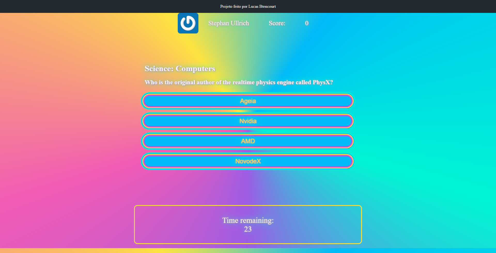

# Trivia

### Seja bem-vindo ao projeto Trivia!

----

Este é um projeto desenvolvido por mim, **Lucas Bitencourt**, durante meu curso pela [Trybe](https://www.betrybe.com/).

O projeto é um jogo Trivia, de perguntas e respostas. As perguntas são requisitadas através da API Open Trivia DB. A aplicação calcula a pontuação baseado na dificuldade da pergunta e no tempo de resposta. Ao final das perguntas, é mostrado o resultado do jogo, com o número de acertos e a pontuação. Também é mostrado um ranking com todos os jogos feitos no dispositivo.

 

## Sumário

- [Objetivo](#objetivo)
- [Resultado](#resultado)
- [Instalação](#instalação)
- [Testes](#testes)
- [Conclusão](#conclusão)

#### Objetivo

O objetivo deste projeto, foi avaliar as seguintes habilidades:

- React
- React Router
- Redux
- Fetch API
- Testes em React-Redux

Estas habilidades poderão ser testadas conforme os arquivos de teste (incluídos neste repositório). 

#### Resultado

Este é o resultado do projeto:

Você também pode visualizar o projeto rodando clicando [aqui](https://lucasbitencourt.com.br/tp-trivia/).

 

## Abaixo, instruções para ter acesso ao código

---

#### Instalação

##### Clonando o repositório localmente

1. Clone o repositório
     - `git clone git@github.com:xlucasbitencourt/tp-trivia.git`
     - Entre na pasta do repositório que você acabou de clonar:
     - `cd tp-trivia`    
   
  
2. Instale as dependências e inicialize o projeto
    - `npm install`
    - `npm start`

 
#### Testes

Para executar os testes, rode o seguinte comando:
`npm run cy:open`

### Atenção: 

Após algumas implementações para que o código fique com um visual mais atrativo, alguns testes poderão falhar. Isso não significa uma má execução do projeto, visto que os testes não foram feitos abordando a implementação extra.

 

## Conclusão

Este é um projeto desenvolvido para aprendizado. Caso queira contribuir com algum feedback, sinta-se a vontade para comentar, ou entre em contato comigo:

  